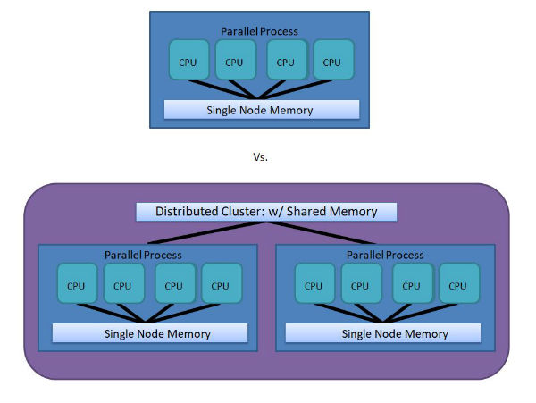

# Parallelizationalisms

"I still think in a parallel universe, I became a mathematician." Ken Liu

## Why Parallel Processing?

## Basic Use Case

- Speeds up ML training / for-loops 
- Reduces cost on per VM basis
- Increases productivity!

## What is "Parallel" vs. "Distributed?

## Distributed Computing Terms

- Cluster ('Nodes' as Distributed Computing)
- Cores ('CPUs' for Parallel Computing)
- Thread ('Processes' as Multithreaded)
- Asyncronous ('Unordered' for speedup and without queue) 
- Syncronous ('Ordered' sequences -- DL/apply-funcs) 

## From Local VM to Big Data Clusters

- R/Python (local)
- ~~Hadoop (Mahout)~~
- Spark (PySpark/SparklyR/Spark ML)
- GPUs and TPUs (Tensorflow/Keras/PyTorch)

# Live Examples in R Walkthrough...

# Questions?

